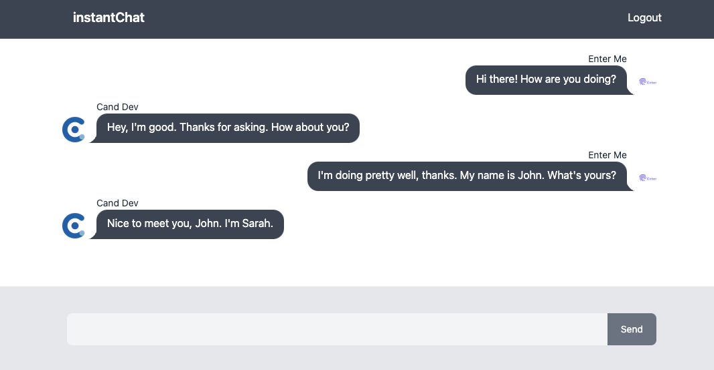

This project was bootstrapped with [vite](https://vitejs.dev/guide/#scaffolding-your-first-vite-project).

<ins>App Preview</ins>

## Available Scripts

In the project directory, you can run:

### `npm install`

Instal All dependencies in this project

### `npm run dev`

Runs the app in the development mode. 
Open [http://127.0.0.1:5173](http://127.0.0.1:5173) to view it in the browser.

### Link

- Vite: https://vitejs.dev/
- DaisyUI: https://daisyui.com/
- Tailwind CSS: https://tailwindcss.com/docs/guides/vite
- Firebase Docs: https://firebase.google.com/docs

### Video Tutorial

You can see my youtube video for this project in [here](https://youtu.be/sNDHYBeOQp4)
